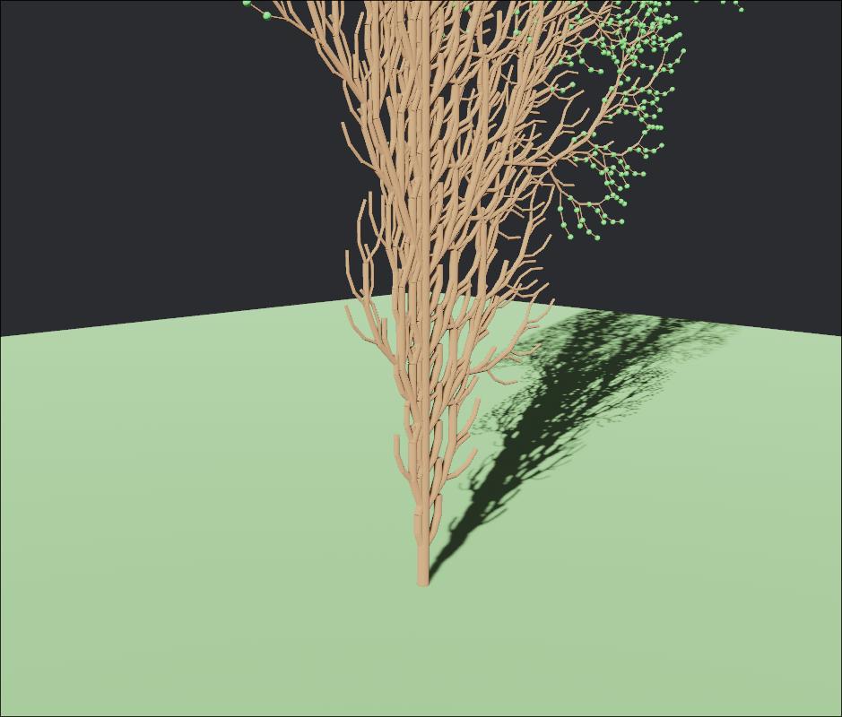

# Seqouia: beautiful tree generator

A procedural tree generation demo built in **Rust** using **Bevy**. The project implements an **L-System (Lindenmayer System)** to generate branching structures and visualizes the resulting tree in real time.

## Features

- Procedural tree generation using L-Systems
- Configurable axiom and production rules
- Adjustable iteration depth
- Real-time rendering with Bevy
- Turtle-graphics style interpretation of generated strings
- Clean Rust implementation suitable for experimentation and learning

## What is an L-System?

An L-System (Lindenmayer System) is a formal grammar originally developed to model plant growth. Starting from an initial string (the **axiom**), production rules are repeatedly applied to generate increasingly complex structures.

For example:

```text
Axiom:
F

Rule:
F → F[+F]F[-F]F
```

After several iterations, the generated string can be interpreted as drawing instructions to produce tree-like structures.

## Rendering

The generated L-System string is interpreted using a turtle graphics approach:

| Symbol | Meaning |
|---------|---------|
| F | Move forward and draw |
| + | Rotate clockwise |
| - | Rotate counter-clockwise |
| [ | Push current state |
| ] | Pop previous state |

Branches are created by storing and restoring turtle state whenever a branch begins or ends.

## Getting Started

### Prerequisites

- Rust (latest stable recommended)
- Cargo

Install Rust:

```bash
rustup install stable
```

### Build

```bash
cargo build
```

### Run

```bash
WGPU_BACKEND=vulkan cargo run --release
```

## Configuration

L-System parameters can be modified in the source code:

```rust
let axiom = "F";
let rules = vec![
    ("F", "F[+F]F[-F]F"),
];
let iterations = 5;
```

Adjusting the production rules, branch angles, segment lengths, or iteration count can produce a wide variety of plant and tree forms.

## Example Output

The demo generates branching structures similar to:

```text
        /\
       /  \
      / /\ \
     / /  \ \
    /_/    \_\
```

Actual output is rendered using Bevy and may vary depending on configuration:



## Performance Notes

The number of generated symbols grows exponentially with iteration depth. Large iteration counts can significantly increase memory usage and rendering cost.

Typical values:

| Iterations | Complexity |
|------------|------------|
| 3–5 | Fast |
| 6–7 | Moderate |
| 8+ | Potentially expensive |

## Future Improvements

- Interactive parameter editing
- Multiple plant species presets
- Wind animation
- 3D branching systems
- Mesh-based rendering
- Export generated structures

## Learning Resources

- [L-Systems (Wikipedia)](https://en.wikipedia.org/wiki/L-system)
- [The Algorithmic Beauty of Plants](http://algorithmicbotany.org/papers/abop/abop.pdf)
- [Bevy Game Engine](https://bevyengine.org/)
- [The Rust Programming Language](https://doc.rust-lang.org/book/)

## License

MIT License